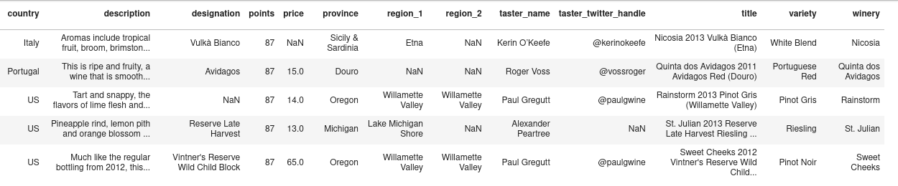
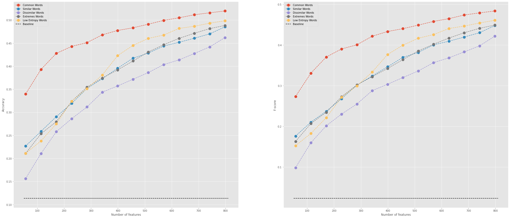

# Reviewed Grapes

Did you ever had to chance to look at wine reviews? If not, here's a glimpse:

> _Pineapple rind, lemon pith and orange blossom start off the aromas. The palate is a bit more opulent, with notes of honey-drizzled guava and mango giving way to a slightly astringent, semidry finish._

> _Tart and snappy, the flavors of lime flesh and rind dominate. Some green pineapple pokes through, with crisp acidity underscoring the flavors. The wine was all stainless-steel fermented._


_Samples taken from [here](https://www.kaggle.com/zynicide/wine-reviews)._

It should be permitted to ask whether such reviews are just purple gibberish, or the esteemed spot-on judgment of a connoisseur.
I wouldn't know!
But maybe ML can tell us whether there is something to it.

# The Dataset

The dataset consists of ~130k wine reviews that were scraped from the [WineEnthusiast (winemag.com)](http://www.winemag.com/?s=&drink_type=wine) website in 2017.
It is released under [CC BY-NC_SA 4.0](https://creativecommons.org/licenses/by-nc-sa/4.0/) licenses and can be [downloaded on kaggle](https://www.kaggle.com/zynicide/wine-reviews).



Each review contains additional information about the wine (designation, country, province, region, winery, variety and price), the reviewer (identifier) and the review (text, score [1-100])


## Use Case

The goal of this project is to determine if wine reviews can be used to determine the grape variety of the reviewed wine.
If we can train a machine learning model to predict the wine variety with some accuracy, then wine reviews must, at least occasionally, contain some information that is specific to a grape variety of the reviewed wine.

Hence **we will define and train a machine learning model to predict the wine variety based on the written review of a wine.**
We will use existing wine review data and a combination of traditional and deep learning ML methods.

## Outcome

**All of the 5 models we defined perform much better than educated guessing base on marginal label probability (baseline)**.

Depicted below are cross-validated accuracy and averaged f-score.

Interestingly, among the 5 models, the one that does **not** rely on deep learning for the feature engineering, the _Common Words_ model, performs best.



---

# Project Structure

The project follows largely the [IBM cloud garage methodology for data science](https://developer.ibm.com/articles/the-lightweight-ibm-cloud-garage-method-for-data-science/).

The order of the notebook list here-below follows the project development structure and contains all relevant information. Additional content that is present in the project is used or created by these notebooks.

### File structure

- [reviewed_grapes.data_exp.pandas.v1.ipynb](reviewed_grapes.data_exp.pandas.v1.ipynb)
  - Data quality assessment
  - Exploration of the original dataset
  - Identification of required preprocessing
- [reviewed_grapes.etl.pandas.v1.ipynb](reviewed_grapes.etl.pandas.v1.ipynb)
  - Implementation of required preprocessing
  - Conversion to data structure suitable for feature creation
- [reviewed_grapes.model_baseline.pyspark.v1.ipynb](reviewed_grapes.model_baseline.pyspark.v1.ipynb)
  - Implementation, training, evaluation and deployment of the baseline model
- [reviewed_grapes.feature_eng.pyspark.v1.ipynb](reviewed_grapes.feature_eng.pyspark.v1.ipynb)
  - Feature engineering steps including NLP and deep learning
  - Definition of custom pyspark Transformer and Estimator sub-classes that implement the required feature engineering steps
- _[reviewed_grapes.feature_eng_SI.pyspark_keras_elephas.v1.ipynb](reviewed_grapes.feature_eng_SI.pyspark_keras_elephas.v1.ipynb)_
  _(supplemental information, unused downstream)_
  
  - word-2-vector encoding of review words and wine varieties based on keras implementation of an auto-encoder
  - deployment of this word-2-vector encoding routine on spark worker with the elephas package.
- [reviewed_grapes.model_def_train.pyspark.v1.ipynb](reviewed_grapes.model_def_train.pyspark.v1.ipynb)
  - Definition of the various models as spark ML-Pipelines
  - Training of the models
- [reviewed_grapes.model_evaluation.pyspark.v1.ipynb](reviewed_grapes.model_evaluation.pyspark.v1.ipynb)
  - Evaluation of our trained models
  - Exploration of several alternative models
  - Hyperparameter tuning for some of the models
- [reviewed_grapes.model_deployment.pyspark.v1.ipynb](reviewed_grapes.model_deployment.pyspark.v1.ipynb)
  - Adapting the fitted models to make them deployable
  - Packing of fitted models and necessary wrapper class to utilize python's  [setuptools](https://setuptools.readthedocs.io/en/latest/userguide/quickstart.html) for distribution
  
### Additional Content

- `reviewed_grapes/`: Python package that holds fitted models and all necessary scripts to deploy them (see [Model Deployment](#Model-Deployment) for details)
- `data/`: Contains the original dataset, as well as any intermediary data
- `utils/`: python package containing definitions of custom pyspark estimators and transformers used to construct our models.


## Project Setup
The project can be cloned form GitHub:

    git clone git@github.com:j-i-l/ReviewedGrapes.git
    
To set up the project, create a virtual environment and install all dependencies with:

    pip install -r requirements.txt

You should also fetch the [wine review dataset from kaggle](https://www.kaggle.com/zynicide/wine-reviews) and place the \*.csv files under _data/_.

After these steps you should be able to run all the notebooks provided with this project. For further details on the project structure refer to the [Project Structure](#Project-Structure) section.

## Model Deployment
Several trained models can be found under  _reviewed_grapes/fitted_models/_ and are readily deployable as [spark MP-Pipelines](https://spark.apache.org/docs/latest/ml-pipeline.html). 

For pyspark users trained models are made available in the `reviewed_grapes` package that can be installed with the provided [setup.py](setup.py).

In short:

1. Fire-up your virtual environment. 

2. Install the package with the trained models:
  ```bash
  pip install git+https://github.com/j-i-l/ReviewedGrapes.git
  ```
  
  _Alternatively, you can also clone and then install it_:
  
    git clone git@github.com:j-i-l/ReviewedGrapes.git
    cd ReviewedGrapes
    pip install ./

Now you can simply import and use the fitted models:

```python
>>> from reviewed_grapes import CommonWordsModel
>>> sentence_df = spark.createDataFrame(
        [("A superbe red wine with blackberry and stuff.",),
         ("Acid dark too strong for me.",),
         ("Tart and snappy, supple plum aroma.",)],
        ["review"])  

>>> cmw = CommonWordsModel(inputCol='review', outputCol='predicted variety')
>>> cmw.transform(sentenceDataFrame).select('review', 'predicted variety').show()
+--------------------+------------------+                                                                                                                                                                       
|              review| predicted variety|                                                                                                                                                                       
+--------------------+------------------+                                                                                                                                                                       
|A superbe red win...|cabernet sauvignon|                                                                                                                                                                       
|Acid dark too str...|        pinot noir|                                                                                                                                                                       
|Tart and snappy, ...|        pinot noir|                                                                                                                                                                       
+--------------------+------------------+ 
```

---
# General Model Approach

The general idea behind the models we define is to track the presence/absence of a set of specific words in the review text.

The general pattern is as follows:

1. Convert the wine variety column to a categorical label.
2. Render each word in the review text to a canonical form.
3. Use a predefined set of words, a _target word set_, to create a feature vector of binary features, each indicating the presence or absence of one of the words in the target word set.
4. Define a ML model that can predict the label based on this features.
5. Train the model on a training set and assess its performance.
6. Deploy the model.

What will define our different models is how we define the **target word set** in step 3.
It is also the point where we will implement and use some deep learning methods.

### Baseline
The aim of this model is to establish a baseline in terms of performance.
It is a non-predictive model in the sense that it does not use the review text at all.
Instead it simply relies on the label frequencies of the training data and uses their marginal probabilities to make predictions.

### Common Words
Here we count the occurrence of all different words in the reviews of the training dataset, rank them by count and take the _x_-most common words to be our target word set.

### Word2Vec based
This approach is based on a more sophisticated feature engineering to create the target word set.
We first train an autoencoder on word pairs, i.e. we create a word-to-vector map.
For each word in the set of canonical words in a review (from general step 2) we combine it with the wine variety and compile a dataset of word-variety mapping pairs.
We train a word2vec deep learning network and use the hidden layer as vector representations of all words and varieties.

With this embedding of review words and varieties into a vector space we can now construct target word sets based on the relation between vectors.
In particular we can measure similarity between all members in this vector space and assemble target word sets based on similarity considerations.

#### Similar Words
A first approach is to create the target word set by picking for all varieties present in the training dataset the most similar words.

#### Dissimilar Words
Another option is the exact opposite and pick the least similar words, i.e. the vectors that point into an opposite direction.

#### Extremes
As a third variation we pick the most and the least similar words for each variety.

#### Low Entropy Words
Finally, we note that the presence any word from the target word set should give us some information about what wine variety was concerned in that review.
Words that are equally likely to be present in any review are thus bad candidates for the target words set.
We want words that are found only in reviews from some varieties and not in others.
In terms of the vector space we created, we are looking for word-vectors that are not equally similar to all variety-vectors.
Said differently, we want to use words for which the distribution of similarities with all variety-vectors is as far away from uniform as possible.
One way to measure the non-uniformity of a distribution is the information entropy.
It is maximal if the similarity is the same for all variety-vectors.
Thus, in this model, our target word set will consist of words with the lowest entropy in their similarity distribution.